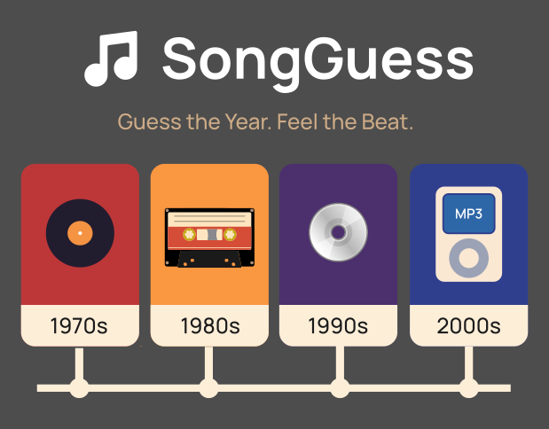
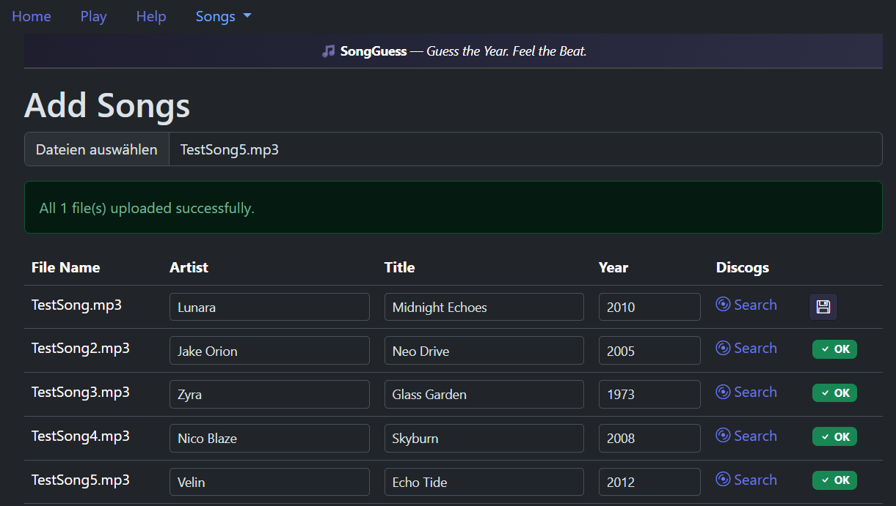
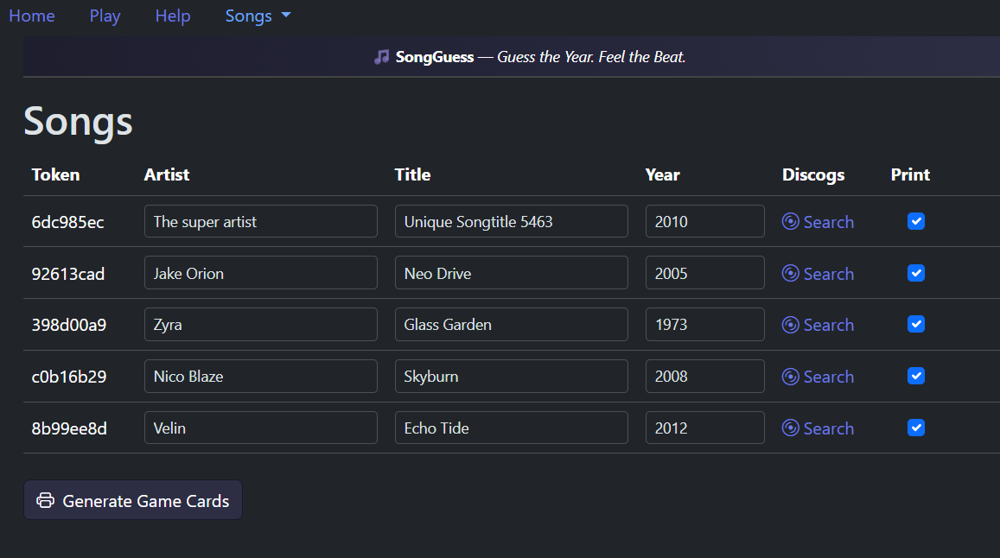
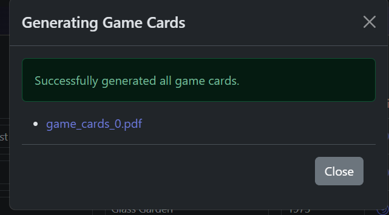
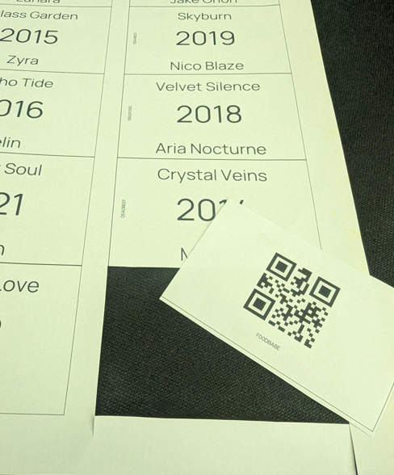
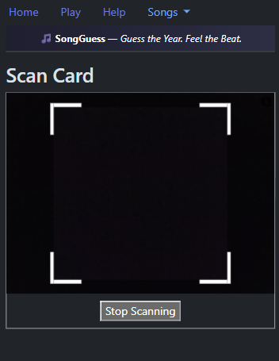
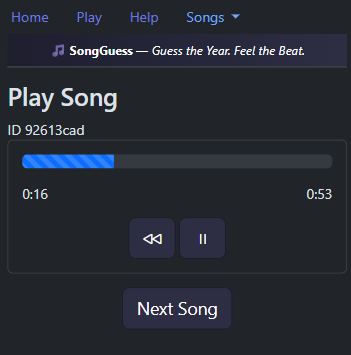

# SongGuess
A song guessing game for your local music library

This game is like a known commercial game, but this runs locally in a Docker container and uses your local MP3 library. So you can use your favourite music without any cloud service.

It generates a local self-signed SSL certificate, so the Docker is reachable by https. This is necessary for accessing the camera for QR code scanning. Because of this local generated certificate, you get a security warning, which can be ignored due local using.

The songs are copied into the container, so be aware that the data size will increase a lot depending on the number of used songs.

The game cards are generated with PIL und Qrcode. They can be printed directly onto AVERY Zweckform C32010-25 business card breakout cards, so you get pretty decent cards. Or just print on plane paper and cut them out. The cards are generated and optimized for two-sided print if your printer supports this. Just select "Print double sided, flip on long side".

The songs are copied into the container to avoid relocation problems. The data of the songs are stored in a simple SQLite database. The song data is read from its ID3 tag.

## Installation

1. git clone https://github.com/3komma3volt/SongGuess.git
2. docker-compose build
3. docker-compose up

## Game setup
1. Navigate to `https://<your computer name>`

2. Click on Songs -> Add

3. Drag & Drop your desired MP3 files onto the upload section

4. Check the names of artist, title and the year. You can click the lookup link to search for information on Discogs.

5. If you modify some song information, click on "Save" to save the infos.

6. Navigate to Songs -> List

7. Check the songs you want the game cards to be generated

8. Click on "Generate Game Cards"

9. Print the cards and cut them out

## Playing

Navigate to `https://<networks computer name>`

Click on play and scan a random QR code. 

The song behind this code will be played.

Let the other player guess the artist, the title or the year and give them one point for every correct answer (Or a similar scoring system).

## Used Libraries

### Web Libraries
- [jQuery](https://jquery.com/)
- [Bootstrap](https://getbootstrap.com/)
- [Html5Qrcode](https://github.com/mebjas/html5-qrcode)

### Python Libraries
- [Mutagen](https://mutagen.readthedocs.io/)
- [fpdf2](https://pyfpdf.github.io/fpdf2/)

### ToDo:   
Here some maybe features for future development
- Add option to add song categories
- Add play by category option
